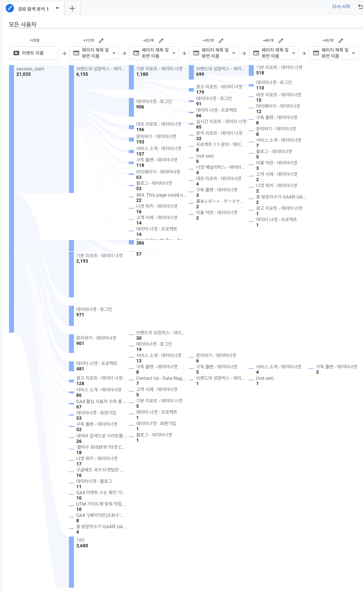
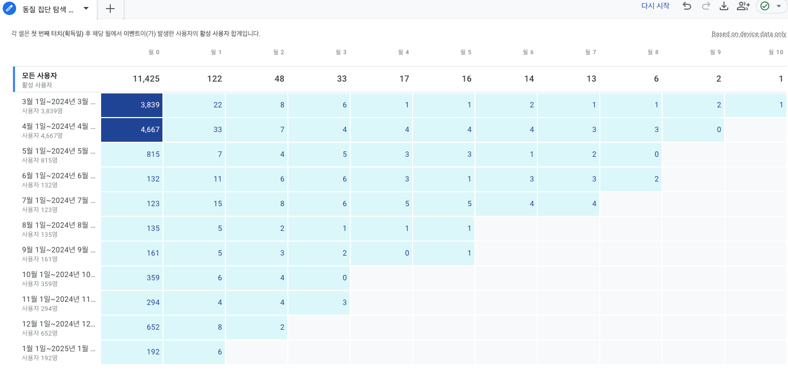

## GA 탐색리포트&코호트 분석

### 경로 탐색 분석

* 기간 : 최근 1년
* 접속 후 메인페이지 (브랜드 성장박스)에서 로그인 및 첫 페이지 인 '기본 리포트' 사용이 높지만 통합광고 리포트, 분석 리포트 비중이 높지 않아 계정 연결에 어려움을 겪거나 계정이 없는 고객이 많치 않은지 상세 분석할 필요 있을 것으로 판단됩니다.

#### 코호트 (동질 집단 탐색) 분석

* 기간 : 최근 1년
* 첫 유입 후 한달 후 유입이 급격히 줄어드는 것으로 보아 계정 연결을 많이 하지 않아 각 서비스 소개와 기본 리포트 외 접근이 없어 지속적인 사용이 없는 것으로 판단됩니다.